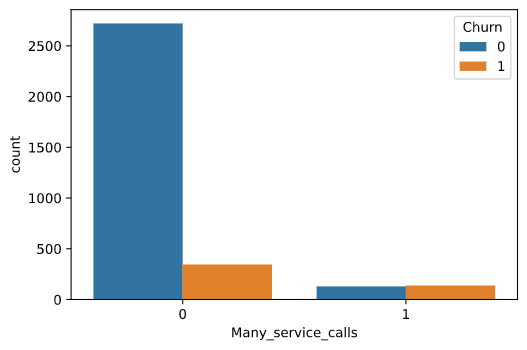
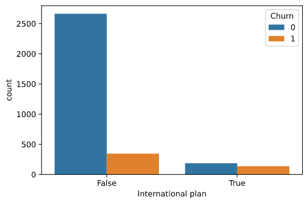
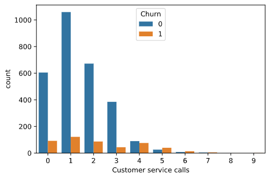

# Exploratory Data Analysis on Telecom Churn
>By Parth Mistry

* We have this ‘Telco Churn’ data, which has information about each customer of this telco company along with whether if a given customer has chunred or not.

* I wanted to understand what makes customers churn or not, and also wanted to know what we could do to prevent the churn.

## Code and Resources Used 
**Python Version:** 3.7  
**Packages:** pandas, numpy

## EDA
I found some insights after analysing the patterns in the data. And I found this.

